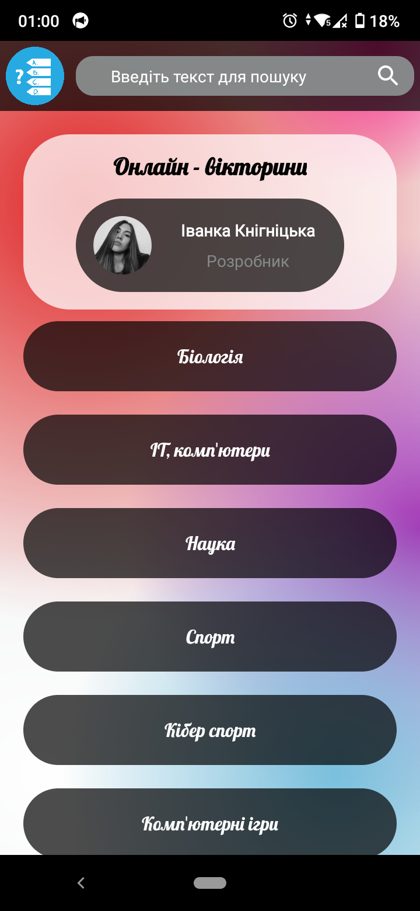
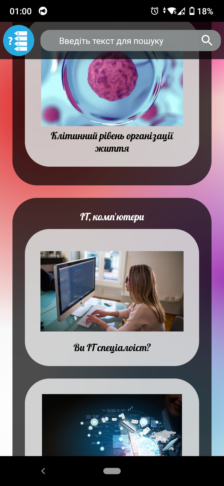
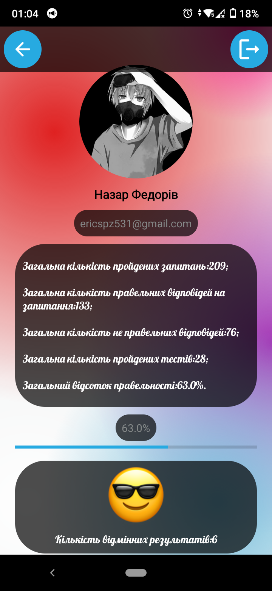
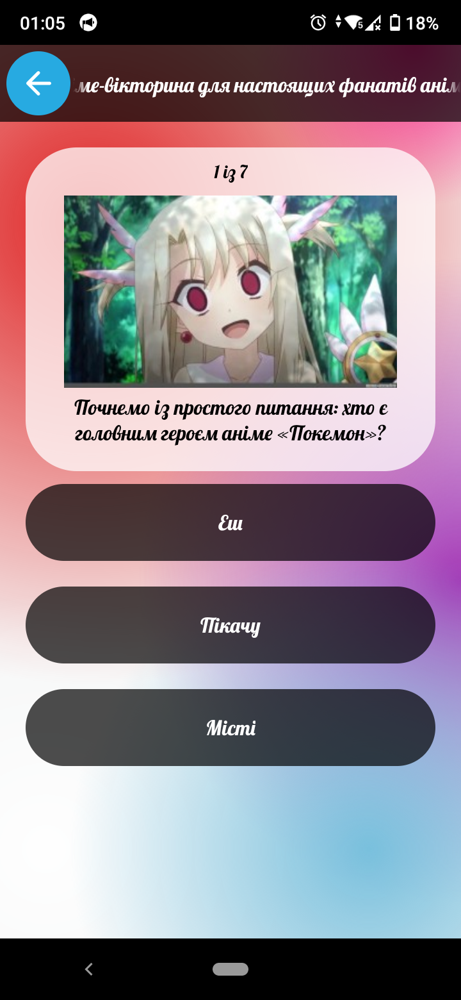
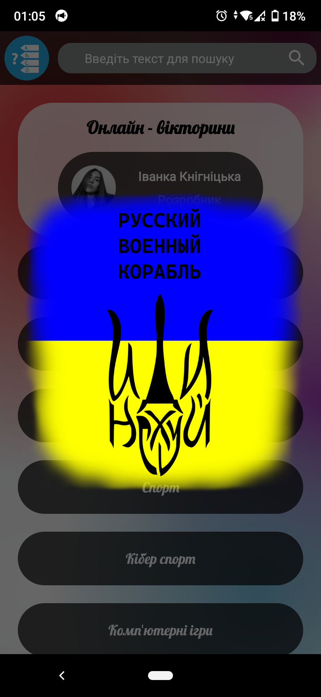
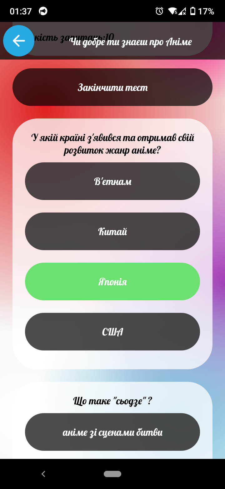
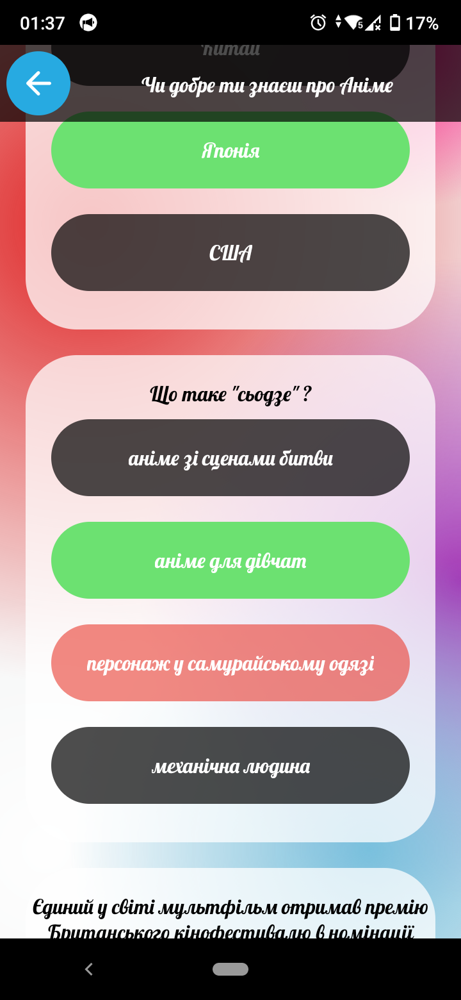

<p align="center"></p>
<h1 align="center">OnlineVictorineApp</h1>

## Description
<b>EN:</b>

Ordered course work on the topic "Design and development of the software product «Mobile application Quiz»".

This is a mobile app quiz game that works through the previous coursework **API** ([online-victorine.com](https://github.com/CoolOtaku/online-victorine.com)).

In order for the application to cooperate with the **Google** service. **Google** credentials required [credentials.json](https://github.com/CoolOtaku/OnlineVictorineApp/blob/main/app/credentials.json).

<b>UA:</b>

Замовлена курсова робота на тему "Проектування та розробка програмного продукту «Мобільний додаток Вікторина»".

Це мобільний додаток гра у вікторини, який працює через **API** попередньої курсової роботи ([online-victorine.com](https://github.com/CoolOtaku/online-victorine.com)). 

Для того, щоб співпрацював додаток із сервісом **Google**. Потрібні дані для авторизації **Google** [credentials.json](https://github.com/CoolOtaku/OnlineVictorineApp/blob/main/app/credentials.json).

#
## Screenshots:
<p>
  
  
  
  
  
  
  
</p>

#
## Technologies used
<b>EN:</b>
- Image caching and rendering via [**Picasso**](https://square.github.io/picasso/)
- Using [**Retrofit**](https://square.github.io/retrofit/) to communicate with the site's **API**
- Working with the **JSON** format parsing into a regular object
- Using the element interface to display a list of elements from an array (**RecyclerView**)
- Creating a quiz game in **Java**
- Authorization through **Google**
- Convenient navigation and information search
- Calculation of statistics

<b>UA:</b>
- Кешування та відображення зображення через [**Picasso**](https://square.github.io/picasso/)
- Використання [**Retrofit**](https://square.github.io/retrofit/) для спілкування з **API** сайту
- Робота з форматом **JSON** парсинг в звичайний об'єкт
- Використання інтерфейсу елемента для відображення списку елементів з масиву (**RecyclerView**)
- Створення гри-вікторини на **Java**
- Авторизація через **Google**
- Зручна навігація та пошук інформації
- Калькуляція статистики

#
## License
```
© 2022, CoolOtaku (ericspz531@gmail.com)
```
